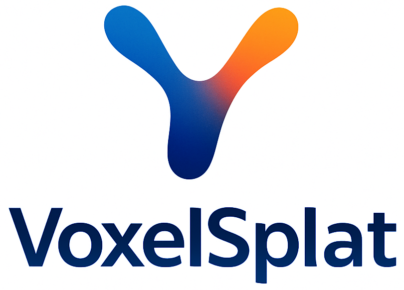
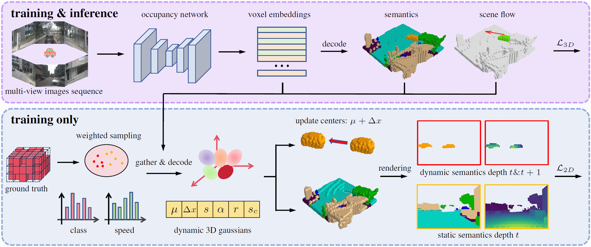

<p align="center">
  
</p>

<h1 align=center font-weight:100> [CVPR2025] VoxelSplat: Dynamic Gaussian Splatting as an Effective Loss for Occupancy and Flow Prediction</h1>

<p align="center">
    <a href="zhuziyue@mail.nankai.edu.cn">Ziyue Zhu</a>
    &nbsp;·&nbsp;
    <a href="https://shenlong.web.illinois.edu/">Shenlong Wang</a>
    &nbsp;·&nbsp;
    <a href="https://csjinxie.github.io/">Jin Xie</a>
    &nbsp;·&nbsp;
    <a href="https://jjliu.net/">Jiang-jiang Liu</a>
    &nbsp;·&nbsp;
    <a href="https://jingdongwang2017.github.io/">Jingdong Wang</a>
    &nbsp;·&nbsp;
    <a href="https://scholar.google.com/citations?user=6CIDtZQAAAAJ&hl=zh-CN">Jian Yang</a>
    <h3 align="center"><a href="https://arxiv.org/abs/2506.05563">Paper</a> | <a href="https://zzy816.github.io/VoxelSplat-Demo/">Project Page</a> </h3>
  </p>

VoxelSplat is a novel regularization framework that leverages dynamic 3D Gaussian Splatting to improve the prediction of occupancy and scene flow.

## Framework



Recent advances in camera-based occupancy prediction aim to jointly estimate 3D semantics and scene flow. We propose <strong>VoxelSplat</strong>, a novel regularization framework that leverages 3D Gaussian Splatting to improve learning in two key ways:
<br>
(<i>i</i>) <strong>2D-Projected Semantic Supervision</strong>: During training, sparse semantic Gaussians decoded from 3D features are projected onto the 2D camera view, enabling camera-visible supervision to guide 3D semantic learning.
<br>
(<i>ii</i>) <strong>Enhanced Scene Flow Learning</strong>: Motion is modeled by propagating Gaussians with predicted scene flow, allowing enhanced flow learning from adjacent-frame labels.
<br>
<strong>VoxelSplat</strong> integrates easily into existing occupancy models, improving both semantic and motion predictions without increasing inference time.
<!-- ⏳ Full code is under final preparation and will be released in the coming days. Thank you for your patience! ⏳ -->

## News
- [2025/7]: Code and pre-trained weights are released.
- [2025/3]: Paper is accepted on **CVPR 2025**.

## 🕹️ Getting Started
- [Installation](docs/install.md)
- [Prepare Dataset and Checkpoints](docs/prepare_datasets.md)
- [Run and Evaluation](docs/start.md)

## Performance

| Backbone | Config | Image Size | Epochs | Train Pretrain | Memory | RayIoU | mAVE | checkpoints | 
| :---: | :---: | :---: | :---: | :---: | :---: | :---: | :---: | :---: |  
| R50       | [FB-Occ (Baseline)](occupancy_configs/voxelsplat/fbocc-flow.py)        | 256 x 704  | 48 | [ImageNet](https://github.com/zhiqi-li/storage/releases/download/v1.0/r50_256x705_depth_pretrain.pth)        | 17 G | 33.57 | 0.504 | [model] |
| R50       | [voxelsplat-r50](occupancy_configs/voxelsplat/voxelsplat-r50.py)       | 256 x 704  | 48 | [ImageNet](https://github.com/zhiqi-li/storage/releases/download/v1.0/r50_256x705_depth_pretrain.pth)        | 19 G | 37.14 | 0.312 | [model] |
| EVA-VIT   | [voxelsplat-eva](occupancy_configs/voxelsplat/voxelsplat-eva.py)       | 640 x 1600 | 24 | [ImageNet](https://github.com/exiawsh/storage/releases/download/v1.0/eva02_L_coco_det_sys_o365_remapped.pth) | 28 G | -     | -     | [model] |
| Intern-XL | [voxelsplat-intern](occupancy_configs/voxelsplat/voxelsplat-intern.py) | 640 x 1600 | 24 | [Nus-Det](https://drive.google.com/file/d/1YQxwgIGHRKvBSI8RvNmJ61d_fUZR3pcb/view?usp=sharing)                | 39 G | -     | -     | [model] |

## Citation
If you find our paper and code useful for your research, please consider citing:

```bibtex
@inproceedings{zhu2025voxelsplat,
  title={Voxelsplat: Dynamic gaussian splatting as an effective loss for occupancy and flow prediction},
  author={Zhu, Ziyue and Wang, Shenlong and Xie, Jin and Liu, Jiang-jiang and Wang, Jingdong and Yang, Jian},
  booktitle={Proceedings of the Computer Vision and Pattern Recognition Conference},
  pages={6761--6771},
  year={2025}
}
```